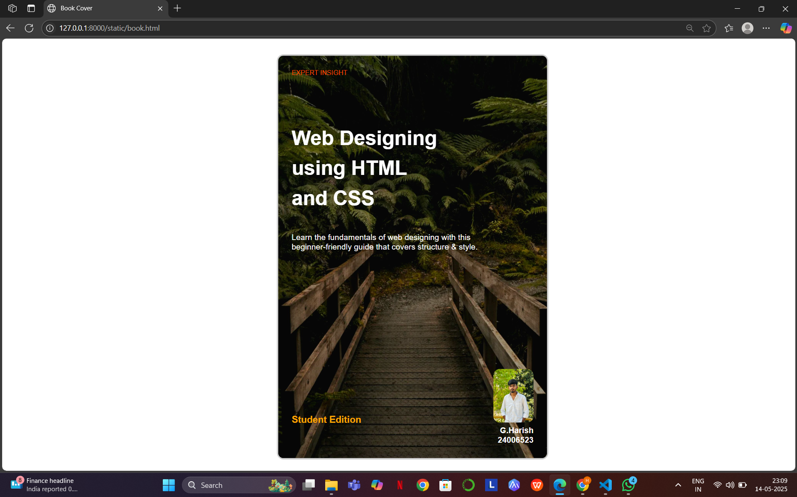

# Ex.06 Book Front Cover Page Design
## Date:14.06.2025

## AIM:
To design a book front cover page using HTML and CSS.

## DESIGN STEPS:

### Step 1:
Create a Django Admin project.

### Step 2:
Create an app in the Django interface.

### Step 3:
Create a folder named 'static' in the app folder.

### Step 4:
Create a new HTML file in the static folder.

### Step 5:
Write the HTML code with relevant CSS properties.

### Step 6:
Choose the appropriate style and color scheme.

### Step 7:
Insert the images in their appropriate places.

### Step 8:
Publish the website in the LocalHost.

## PROGRAM:
```

<html>
<head>
  <title>Book Cover</title>
</head>
<body style="
  font-family: Arial, sans-serif;
  background-color: white;
  display: flex;
  justify-content: center;
  align-items: center;
  height: 100vh;
  margin: 0;
">

  <div style="
    position: relative;
    width: 400px;
    height: 600px;
    border: 2px solid #ccc;
    border-radius: 10px;
    overflow: hidden;
    background-image: url('bg.jpg');
    background-size: cover;
    background-position: center;
  ">

    <!-- Top Tagline -->
    <div style="
      position: absolute;
      top: 20px;
      left: 20px;
      color: orangered;
      font-size: 10px;
    ">
      EXPERT INSIGHT<br>
    </div>

    <!-- Main Title -->
    <div style="
      position: absolute;
      top: 100px;
      left: 20px;
      right: 20px;
      color: white;
      font-size: 30px;
      font-weight: bold;
      line-height: 1.5;
    ">
      Web Designing<br>using HTML<br>and CSS
    </div>

    <!-- Subtitle -->
    <div style="
      position: absolute;
      top: 250px;
      left: 20px;
      right: 20px;
      color: white;
      font-size: 12px;
    ">
    <br>Learn the fundamentals of web designing with this
    <br>beginner-friendly guide that covers structure & style.
    </div>

    <!-- Edition Label -->
    <div style="
      position: absolute;
      bottom: 50px;
      left: 20px;
      color: orange;
      font-size: 14px;
      font-weight: bold;
    ">
      Student Edition
    </div>

    <!-- Author Area -->
    <div style="
      position: absolute;
      bottom: 20px;
      right: 20px;
      text-align: right;
    ">
      <br>
      <p style="
        color: white;
        margin: 5px 0 0;
        font-size: 12px;
        font-weight: bold;
      ">
        G.Harish <br> 24006523
      </p>
    </div>

  </div>

</body>
</html>

```

## OUTPUT:


## RESULT:
The program for designing book front cover page using HTML and CSS is completed successfully.
